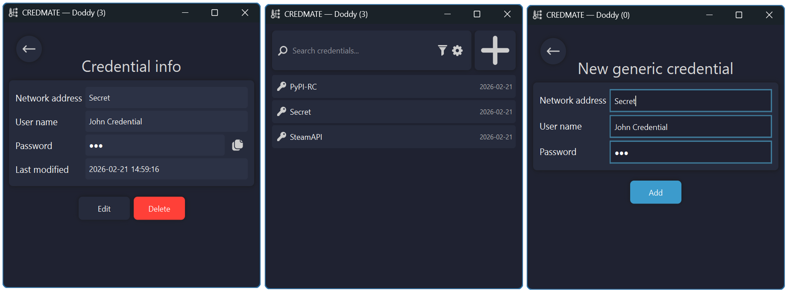

  

<h1 align="center">CREDMATE</h1>

A tiny, minimalist app to manage and view Windows credentials.

## Features
- View stored credentials and passwords
- Add, delete, or update credentials
- Clean, minimalist interface

## Installation
1. Download the ZIP file from the Releases page  
2. Extract it  
3. Open `CredMate.exe` 

  

## License
This project is licensed under the MIT License. See [LICENSE](LICENSE).
